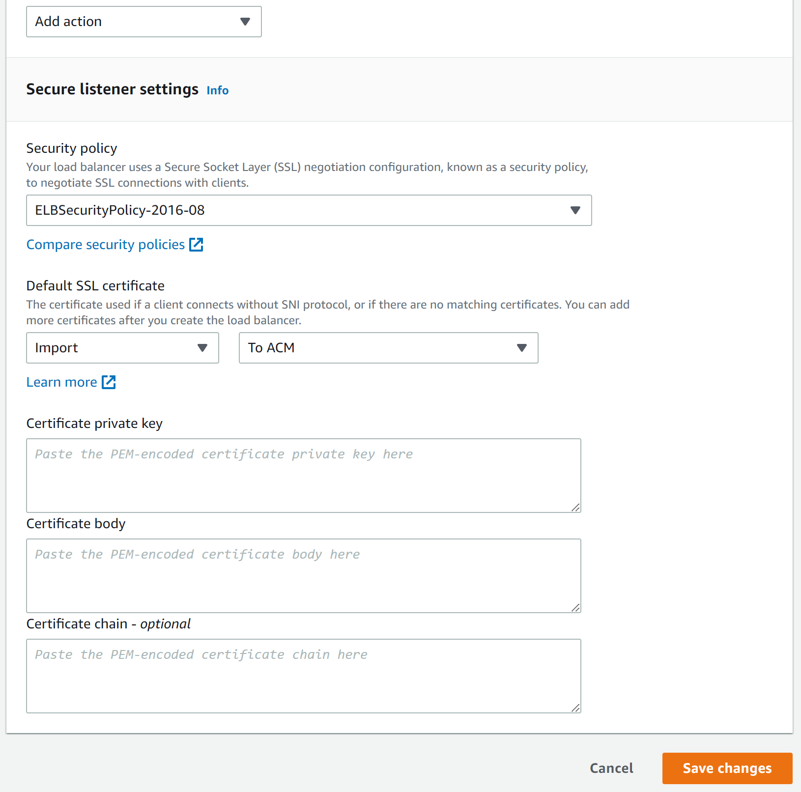
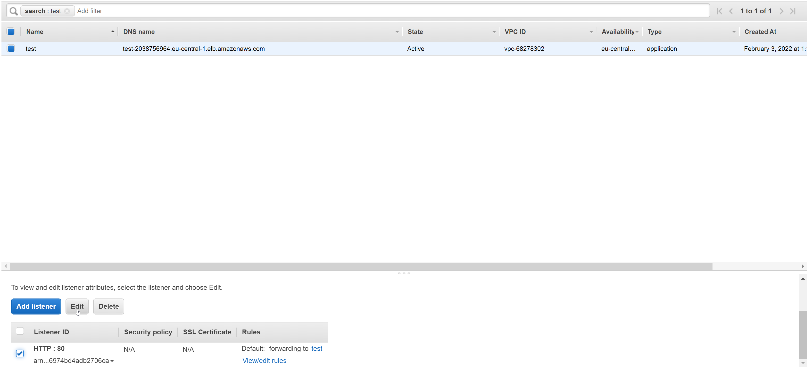

// Add steps as necessary for accessing the software, post-configuration, and testing. Don’t include full usage instructions for your software, but add links to your product documentation for that information.
//Should any sections not be applicable, remove them

== Post-deployment steps
// If post-deployment steps are required, add them here. If not, remove the heading

=== [Optionnal] Add your SSL certificate to the application load balancer

If you did not provide an SSL certificate during the QuickStart installation, you can edit the load balancer listener in order to configure an SSL certificate:

[start=1]
. HTTPS setup 

As shown in  <<postinstall1>>, edit the Application Load Balancer and switch the listener protocol from http to https.

[#postinstall1]
.Application Load Balancer HTTP to HTTPS switch
image::../images/listener_https_settings.png[Postinstall,width=70%,height=70%]

[start=2]
. SSL certificate setup

As shown in  <<postinstall2>>, change the default SSL certificate by either importing yours or selecting a certificate from IAM or ACM.

[#postinstall2]
.Application Load Balancer HTTP to HTTPS switch

=== [Optionnal] Create CNAME record in your DNS provider

If you did not provide the a Route 53 Hosted Zone ARN during the QuickStart installation, you will need to create 2 DNS records into your DNS provider. 

Both need to target the 3decision application load balancer. The address of this load balancer is the "DNS Name" as shown in <<postinstall3>>.

The 2 hosts you must defined are:

[start=1] 
. 3decision.<your domain> ( 3decision user UI )
 
[start=2]
. 3decision-etl.<your domain> ( 3decision admin UI )

[#postinstall3]
.Application Load Balancer HTTP to HTTPS switch

== Test the deployment
Connect to https://3decision.<your domain>.<ext>. An internet browser will show the 3decision login page. An HTTP GET on this URL should reply an HTTP 302 code.

//== Best practices for using {partner-product-short-name} on AWS

== Security
3decision data is stored in EBS volumes. Snapshot policies are not created by the QuickStart. It is highly recommende to configure snapshot policies on 3decision EBS volumes to prevent any data-loss.
// Provide post-deployment best practices for using the technology on AWS, including considerations such as migrating data, backups, ensuring high performance, high availability, etc. Link to software documentation for detailed information.

